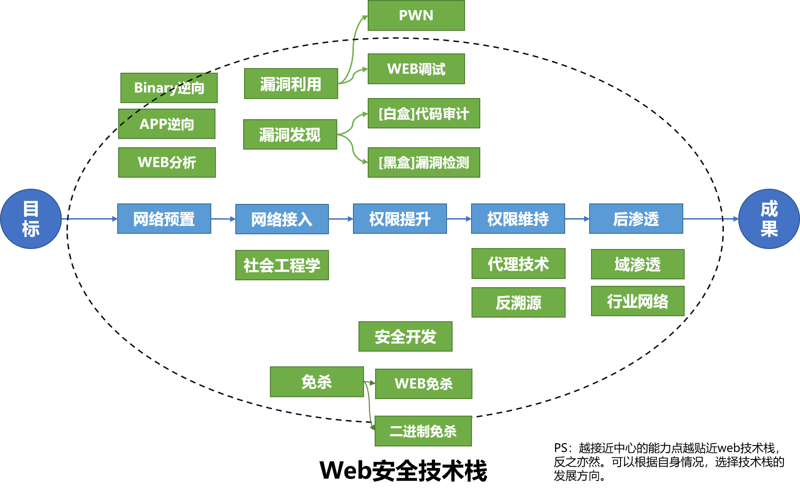

# WEB 安全手册
  

【声明】个人的快速查询目录，经验整理，仅供参考。     
【内容】包括个人对漏洞理解、漏洞利用、代码审计和渗透测试的整理，也收录了他人相关的知识的总结和工具的推荐。    

## 目录
  * [0x00 技能栈](#0x00-技能栈)
  * [0x01 漏洞理解篇(Vulnerability)](#0x01-漏洞理解篇vulnerability)
    * [1.1 前端](#11-前端)
    * [1.2 后端](#12-后端)
    * [1.3 打造自己的知识库](#13-打造自己的知识库)
  * [0x02 漏洞利用篇(Exploit)](#0x02-漏洞利用篇exploit)
    * [2.1 前端安全-XSS](#21-前端安全-xss)
    * [2.2 前端安全-CSRF](#22-前端安全-csrf)
    * [2.9 Server-side request forgery (SSRF)](#29-server-side-request-forgery-ssrf)
    * [2.4  [注入]SQL注入&数据库漏洞利用](#24--注入sql注入数据库漏洞利用)
    * [2.5 [注入]模板注入 Server Side Template Injection (SSTI)](#25-注入模板注入-server-side-template-injection-ssti)
    * [2.6 [注入]命令注入&代码执行](#26-注入命令注入代码执行)
    * [2.7 [注入]Xpath注入](#27-注入xpath注入)
    * [2.8 XML External Entity (XXE)](#28-xml-external-entity-xxe)
    * [2.9 文件操作漏洞](#29-文件操作漏洞)
    * [2.10 反序列化漏洞](#210-反序列化漏洞)
    * [2.11 包含漏洞](#211-包含漏洞)
    * [2.12 Java-特性漏洞](#212-java-特性漏洞)
    * [2.13 NodeJs-特性漏洞](#213-nodejs-特性漏洞)
    * [2.14 不一致性](#214-不一致性)
  * [0x03 代码审计篇(Audit)](#0x03-代码审计篇audit)
    * [3.1 PHP](#31-php)
    * [3.2 JAVA](#32-java)
    * [3.3 .NET](#33-net)
    * [3.4 Perl CGI](#34-perl-cgi)
  * [0x04 渗透篇(Penetration)](#0x04-渗透篇penetration)
    * [4.1 网络预置](#41-网络预置)
      * [4.1.1 代理客户端(环境准备)](#411-代理客户端环境准备)
      * [4.1.2 常规信息（单兵）](#412-常规信息单兵)
      * [4.1.3 资产搜索引擎（大数据）](#413-资产搜索引擎大数据)
      * [4.1.4 移动端信息收集](#414-移动端信息收集)
      * [4.1.5 近源渗透（WiFi）](#415-近源渗透wifi)
    * [4.2 网络接入(exp)](#42-网络接入exp)
      * [4.2.1 漏洞验证（扫描器）](#421-漏洞验证扫描器)
        * [4.2.1.1 主动式](#4211-主动式)
        * [4.2.1.2 被动式](#4212-被动式)
      * [4.2.2漏洞利用(1day)](#422漏洞利用1day)
        * [4.2.2.1 漏洞利用知识](#4221-漏洞利用知识)
        * [4.2.2.2 漏洞利用工具](#4222-漏洞利用工具)
        * [4.2.2.3 dnslog平台](#4223-dnslog平台)
      * [4.2.3 字典](#423-字典)
    * [4.3 权限获取&提升](#43-权限获取提升)
      * [4.3.1 Win](#431-win)
      * [4.3.2 Linux](#432-linux)
      * [4.3.3 Docker&Sandbox逃逸](#433-dockersandbox逃逸)
    * [4.4 权限维持&后门](#44-权限维持后门)
      * [4.4.1 通用](#441-通用)
      * [4.4.2 Shell会话](#442-shell会话)
      * [4.4.2 Webshell](#442-webshell)
      * [4.4.3 PC & Server](#443-pc--server)
      * [4.4.4 Mobile (Android & ios)](#444-mobile-android--ios)
    * [4.5 免杀](#45-免杀)
      * [4.5.1 二进制免杀](#451-二进制免杀)
      * [4.5.2 webshell免杀和WAF逃逸](#452-webshell免杀和waf逃逸)
    * [4.6 隧道&代理](#46-隧道代理)
      * [4.6.1 TCP隧道](#461-tcp隧道)
      * [4.6.2 HTTP隧道](#462-http隧道)
      * [4.6.3 DNS隧道](#463-dns隧道)
      * [4.6.3 ICMP隧道](#463-icmp隧道)
    * [4.7 后渗透](#47-后渗透)
      * [4.7.1 内网信息获取&执行](#471-内网信息获取执行)
      * [4.7.2 轻量级扫描工具](#472-轻量级扫描工具)
      * [4.7.3 渗透框架](#473-渗透框架)
      * [4.7.4 域渗透](#474-域渗透)
      * [4.7.5 云平台](#475-云平台)
    * [4.8 反溯源](#48-反溯源)
    * [4.9 协同](#49-协同)

## 0x00 技能栈
依照红队的流程分工，选择适合自己的技能栈发展。    
>越接近中心的能力点越贴近web技术栈，反之亦然。可以根据自身情况，选择技术栈的发展方向。

## 0x01 漏洞理解篇(Vulnerability)
### 1.1 前端
> 同源策略 & CSP & JOSNP
- [跨域安全](./vul/VUL-CrossDomain.md)
### 1.2 后端
> 应用分层 & 漏洞分类
- [错综复杂的后端逻辑及安全](./vul/VUL-Backend.md)

### 1.3 打造自己的知识库
>爬取范围包括先知社区、安全客、Seebug Paper、跳跳糖、奇安信攻防社区、棱角社区
- [**[Tool]** 推送安全情报爬虫@Le0nsec](https://github.com/Le0nsec/SecCrawler)

## 0x02 漏洞利用篇(Exploit)
### 2.1 前端安全-XSS
> XSS 利用的是用户对指定网站的信任 
- [Cross Site Scripting (XSS)](https://github.com/ReAbout/web-exp/blob/master/exp/EXP-XSS.md)
 ### 2.2 前端安全-CSRF
> CSRF 利用的是网站对用户网页浏览器的信任   
- [Client-side request forgery (CSRF)](https://github.com/ReAbout/web-exp/blob/master/exp/EXP-CSRF.md)
### 2.9 Server-side request forgery (SSRF)
- [SSRF](https://github.com/ReAbout/web-exp/blob/master/exp/EXP-SSRF.md)

###  2.4  [注入]SQL注入&数据库漏洞利用
- [SQL injection - MySQL](./exp/EXP-SQLi-MySQL.md)
- [SQL injection - Oracle](./exp/EXP-SQLi-Oracle.md)
- [SQL injection - MSSQL](./exp/EXP-DB-MSSQL.md)  
> MySQL，Oracle，MSSQL和PostgreSQL的OOB方法
- [SQL injection - 信息外带(OOB)](./exp/EXP-SQLi-OOB.md)

- [Redis 漏洞利用](./exp/EXP-DB-Redis.md)
> go写的命令行版本
- [**[Tool]** 数据库综合利用工具](https://github.com/Hel10-Web/Databasetools)
> 程序检测参数不能为空，导致空口令无法利用
- [**[Tool]** 数据库综合利用工具](https://github.com/Ryze-T/Sylas)
- [**[Tool]** MSSQL利用工具](https://github.com/uknowsec/SharpSQLTools)

### 2.5 [注入]模板注入 Server Side Template Injection (SSTI)
> MVC架构中，模板参数恶意输入产生的安全问题
- [STTI 总述](./exp/EXP-SSTI-ALL.md)
- [SSTI -Python](./exp/EXP-SSTI-Python.md)
- [SSTI -PHP](./exp/EXP-SSTI-PHP.md)
- [SSTI Payload @payloadbox](https://github.com/payloadbox/ssti-payloads)

### 2.6 [注入]命令注入&代码执行
- [命令注入&代码执行-PHP](./exp/EXP-CI-PHP.md)
- [命令注入&代码执行-Java](./exp/EXP-CI-Java.md)
### 2.7 [注入]Xpath注入
> XPath 即为 XML 路径语言
- [XPath Injection](./exp/EXP-XPath.md)
### 2.8 XML External Entity (XXE) 
- [XXE](./exp/EXP-XXE.md)
### 2.9 文件操作漏洞
- [文件上传漏洞](./exp/EXP-Upload.md)
> 远古时期的通杀利器
- [FCKeditor编辑器漏洞利用](./exp/EXP-FCK.md)

### 2.10 反序列化漏洞
>php,java只能序列化数据，python可以序列化代码。   
- [反序列化漏洞-PHP](./exp/EXP-PHP-Unserialize.md)
- [反序列化漏洞-Java](./exp/EXP-Java-Unserialize.md)
- [**[Tool]** 反序列化漏洞利用工具-Java ysoserial](https://github.com/frohoff/ysoserial)
> 拓展payload和添加脏数据绕过waf功能
- [**[Tool]** 反序列化漏洞利用工具 针对Java ysoserial进行拓展](https://github.com/su18/ysoserial)

### 2.11 包含漏洞
- [包含漏洞-PHP](https://github.com/ReAbout/web-exp/blob/master/exp/EXP-Include-PHP.md)

### 2.12 Java-特性漏洞
- [表达式(EL)注入](./exp/EXP-Expression-Injection.md)
- [Spring表达式(SPEL)注入](./exp/EXP-SPEL-Injection.md)
> Confluence和Struct2都使用OGNL
- [OGNL表达式注入](./exp/EXP-OGNL-Injection.md)
- [SprintBoot漏洞利用清单@LandGrey](https://github.com/LandGrey/SpringBootVulExploit)
> 按照清单做的配套工具
- [**[Tool]** SprintBoot漏洞利用工具](https://github.com/0x727/SpringBootExploit)

### 2.13 NodeJs-特性漏洞
- [Node.js 原型链污染](https://github.com/ReAbout/web-exp/blob/master/exp/EXP-nodejs-proto.md)
### 2.14 不一致性
> 利用前后DNS解析的不一致（劫持或者逻辑问题）   
- [DNS rebinding 攻击](./exp/EXP-DNS-Rebinding.md)
> 前后端不一致性
- [请求走私总结@chenjj](https://github.com/chenjj/Awesome-HTTPRequestSmuggling)

## 0x03 代码审计篇(Audit)

### 3.1 PHP
> vscode&phpstorm方案,xdebug2.X和xdebug3.X配置
- [PHP调试环境的搭建](./audit/AUD-PHP-Debug.md)
- [PHP代码审计@bowu678](https://github.com/bowu678/php_bugs)
- [PHP代码审计入门指南@burpheart](https://github.com/burpheart/PHPAuditGuideBook)
### 3.2 JAVA
- [Java调试环境的搭建](./audit/AUD-Java-Debug.md)
- [Java代码审计@cn-panda](https://github.com/cn-panda/JavaCodeAudit)
- [Java安全@Y4tacker](https://github.com/Y4tacker/JavaSec)
- [Java漏洞平台@j3ers3](https://github.com/j3ers3/Hello-Java-Sec)

### 3.3 .NET
- [.Net反序列化@Ivan1ee](https://github.com/Ivan1ee/NET-Deserialize)

### 3.4 Perl CGI
> Perl CGI快速上手，了解Perl语言特性
- [Perl基础&代码审计@mi1k7ea](https://www.mi1k7ea.com/2020/11/24/Perl%E5%9F%BA%E7%A1%80-%E4%BB%A3%E7%A0%81%E5%AE%A1%E8%AE%A1/)

## 0x04 渗透篇(Penetration)
【流程】网络预置（准备&信息收集）-->网络接入（外网突破）-->权限获取和提升-->权限维持（后门）-->后渗透    
【基础】---免杀+++反溯源+++协同---

### 4.1 网络预置

#### 4.1.1 代理客户端(环境准备)
> 操作系统 on VM + OpenWrt网关 on VM = 全局跳板
- [全局代理[VMware]：Openwrt on VMware网关方案](./penetration/PEN-Openwrt.md)

> 全局代理，虚拟网卡，需要手动配路由
- [全局代理[Win]：Windows下socks客户端全局代理终极解决方案——tun2socks](./penetration/PEN-Tun2socks.md)

> SSTap全局代理也是基于虚拟网卡方案，可惜已停止更新，推荐使用1.0.9.7版本
- [**[Tool]** Windows下全局代理客户端工具 SSTap](https://github.com/solikethis/SSTap-backup)

> 【推荐!】Clash for Windows支持TAP模式基于虚拟网卡方案，走全局
- [**[Tool]** Windows下全局代理客户端工具 Clash for Windows](https://github.com/Fndroid/clash_for_windows_pkg)

>Proxifier 全局代理支持并不好，可以设置规则选择指定程序走代理或直连
- [**[Tool]** Windows下代理客户端工具 Proxifier](https://www.proxifier.com/)

- [**[Tool]** Windows版 proxychains](https://github.com/shunf4/proxychains-windows)

#### 4.1.2 常规信息（单兵）
- [外网信息收集思路](https://github.com/ReAbout/web-exp/blob/master/penetration/PEN-Info.md)
- [IP地址信息网站 ipip.net](http://ipip.net)
- [IP反查域名和子域名查询 rapiddns.io](https://rapiddns.io/)
> 有域名层级图，更直观
- [子域名查询 dnsdumpster](https://dnsdumpster.com/)
#### 4.1.3 资产搜索引擎（大数据）
- [fofa.so](https://fofa.so)   
- [shodan.io](https://www.shodan.io/)   
- [zoomeye.org](https://www.zoomeye.org/)
- [censys.io](https://search.censys.io/)
#### 4.1.4 移动端信息收集
>从移动端拓展目标信息
- [**[Tool]** 移动端信息收集工具 AppInfoScanner](https://github.com/kelvinBen/AppInfoScanner)    
- [**[Tool]** 安全分析框架 MobSF](https://github.com/MobSF/Mobile-Security-Framework-MobSF)

#### 4.1.5 近源渗透（WiFi）
> 高通410随身wifi改造
- [打造近源渗透工具](./penetration/PEN-WiFi-Tool.md)

### 4.2 网络接入(exp)

#### 4.2.1 漏洞验证（扫描器）
> 工欲其善必先利器
##### 4.2.1.1 主动式
 - [**[Tool]** AWVS  Docker版](https://hub.docker.com/r/secfa/docker-awvs)
 - [**[Tool]** 长亭的扫描器 Xray](https://github.com/chaitin/xray)   
 - [**[Tool]** Vulmap](https://github.com/zhzyker/vulmap)   
 - [**[Tool]** 红队综合渗透框架SatanSword@Lucifer1993](https://github.com/Lucifer1993/SatanSword)   
##### 4.2.1.2 被动式
>将Burpusuite打造成一个被动式扫描器   
- [**[Tool]** BurpSutie 插件集合@Mr-xn](https://github.com/Mr-xn/BurpSuite-collections)  

#### 4.2.2漏洞利用(1day)
##### 4.2.2.1 漏洞利用知识
- [漏洞索引表]()【待整理】
> IoT安全 & web安全& 系统漏洞 1day整理
- [漏洞利用wiki](https://wiki.96.mk/)
- [红队中易被攻击的一些重点系统漏洞整理@r0eXpeR](https://github.com/r0eXpeR/redteam_vul)
- [织梦全版本漏洞扫描@lengjibo](https://github.com/lengjibo/dedecmscan)
##### 4.2.2.2 漏洞利用工具
- [**[Tool]** Struts2漏洞扫描&利用](https://github.com/HatBoy/Struts2-Scan)
- [**[Tool]** shiro反序列化漏洞利用](https://github.com/wyzxxz/shiro_rce_tool)
- [**[Tool]** EBurstGo Exchange 服务器 Web 接口爆破邮箱账户](https://github.com/X1r0z/EBurstGo)
##### 4.2.2.3 dnslog平台
> 用于出网检测，无回显命令执行检测
- [dnslog.cn](http://dnslog.cn/)
- [ceye](http://ceye.io/)
>【推荐!】好用，开源
- [requestrepo](https://requestrepo.com/)

#### 4.2.3 字典

- [常用的字典，用于渗透测试、SRC漏洞挖掘、爆破、Fuzzing等@insightglacier](https://github.com/insightglacier/Dictionary-Of-Pentesting)
- [Fuzzing相关字典@TheKingOfDuck](https://github.com/TheKingOfDuck/fuzzDicts)
>全拼用户名10w
- [爆破字典](https://github.com/rootphantomer/Blasting_dictionary)

### 4.3 权限获取&提升
#### 4.3.1 Win
**权限获取：**    
> 离线|在线|破解
- [Windows 认证凭证获取](./penetration/PEN-GetHash.md)  
- [**[Tool]** mimikatz Windows认证凭证提取神器](https://github.com/gentilkiwi/mimikatz)
   
**提权:**    
- [Windows提权检测工具 Windows Exploit Suggester](https://github.com/bitsadmin/wesng)
> 已经停止更新到CVE-2018
- [Windows提权漏洞集合@SecWiki](https://github.com/SecWiki/windows-kernel-exploits)
- [PetitPotato for Win10](https://github.com/wh0amitz/PetitPotato)
- [CVE-2022-24481](https://github.com/robotMD5/CVE-2022-24481-POC)
#### 4.3.2 Linux
**权限获取：**    
- [Linux 认证凭证获取](./penetration/PEN-GetHash-Linux.md)

**提权:**     
- [Linux 提权检测脚本 lse.sh](https://github.com/diego-treitos/linux-smart-enumeration)
- [Linux setuid提权](./penetration/PEN-Setuid-Linux.md)
> 已经停止更新到CVE-2018
- [Linux提权漏洞集合@SecWiki](https://github.com/SecWiki/linux-kernel-exploits)

#### 4.3.3 Docker&Sandbox逃逸

- [Dokcer容器逃逸@duowen1](https://github.com/duowen1/Container-escape-exps)

### 4.4 权限维持&后门
#### 4.4.1 通用
- [Meterpreter of Metasploit 使用教程](./penetration/PEN-MSF.md)
> backdoor生成，meterpreter操作指令
#### 4.4.2 Shell会话
- [反弹/正向 Shell & 升级交互式Shell (Linux&Win)](./penetration/PEN-ReShell.md)
#### 4.4.2 Webshell
- [**[Tool]** WebShell管理工具 菜刀](https://github.com/raddyfiy/caidao-official-version)
- [**[Tool]** WebShell管理工具 蚁剑](https://github.com/AntSwordProject/AntSword-Loader)
- [**[Tool]** WebShell管理工具 冰蝎](https://github.com/rebeyond/Behinder)
- [**[Tool]** WebShell管理工具 哥斯拉](https://github.com/BeichenDream/Godzilla)
- [收集的各种Webshell@tennc](https://github.com/tennc/webshell)

#### 4.4.3 PC & Server
- [**[Tool]** Cobalt Strike ]()
- [Cobalt Strike资料汇总@zer0yu](https://github.com/zer0yu/Awesome-CobaltStrike)
#### 4.4.4 Mobile (Android & ios)  
### 4.5 免杀
#### 4.5.1 二进制免杀
- [免杀系列文章及配套工具@TideSec](https://github.com/TideSec/BypassAntiVirus)
#### 4.5.2 webshell免杀和WAF逃逸
- [Webshell免杀&WAF逃逸](./penetration/Webshell-Bypass.md)
- [**[Tool]** 哥斯拉WebShell免杀生成@Tas9er](https://github.com/Tas9er/ByPassGodzilla)
- [**[Tool]** 冰蝎WebShell免杀生成@Tas9er](https://github.com/Tas9er/ByPassBehinder)
- [**[Tool]** 免杀webshell生成集合工具](https://github.com/cseroad/Webshell_Generate)
### 4.6 隧道&代理
#### 4.6.1 TCP隧道
- [SSH 端口转发&开socks5](./penetration/PEN-ssh.md)
- [Iptables 端口复用](./penetration/PEN-Reuse.md)
 > FRP 客服端和服务端配合的端口转发工具
- [**[Tool]** 反向端口转发工具 FRP](https://github.com/fatedier/frp)
> Venom 可以嵌套多层代理，适合多层无外网的渗透测试，停止更新
- [**[Tool]** 内网多级代理服务端工具 Venom](https://github.com/Dliv3/Venom/releases)
> 【推荐!】比Venom更加稳定，持续更新
- [**[Tool]** 内网多级代理服务端工具 Stowaway](https://github.com/ph4ntonn/Stowaway)
#### 4.6.2 HTTP隧道
>HTTP代理，国内更新维护
- [**[Tool]** HTTP代理 Neo-reGeorg](https://github.com/L-codes/Neo-reGeorg)
>HTTP代理，号称性能是neo的10倍
- [**[Tool]** HTTP代理 suo5](https://github.com/zema1/suo5)
#### 4.6.3 DNS隧道
- [**[Tool]** DNS隧道工具 iodine](https://github.com/yarrick/iodine)
#### 4.6.3 ICMP隧道
- [**[Tool]** ICMP隧道工具 PingTunnel](https://github.com/esrrhs/pingtunnel)

### 4.7 后渗透
#### 4.7.1 内网信息获取&执行
> 信息获取 & 远程文件操作 & 远程执行命令 & ipc$ & wmi & winrm
- [Windows 主机常用命令](./penetration/PEN-WinCmd.md)
> wmi,smb等执行脚本，python方便liunx使用
- [**[Tool]** Impacket](https://github.com/fortra/impacket)
> 可以提取流量中用户名&密码，NTML Hash，图片等，以及绘制网络拓扑。
- [**[Tool]** 流量取证工具 BruteShark](https://github.com/odedshimon/BruteShark)
> Windows rdp相关的登录记录导出工具。
- [**[Tool]** 浏览器数据导出解密工具](https://github.com/moonD4rk/HackBrowserData)
- [**[Tool]** SharpRDPLog](https://github.com/Adminisme/SharpRDPLog)
####  4.7.2 轻量级扫描工具
> 内网扫描神器，go语言跨平台，效率快，支持各类口令爆破，还有主机识别和web服务识别。
- [**[Tool]** fscan](https://github.com/shadow1ng/fscan)
> k8 team的内网扫描器
- [**[Tool]** Landon](https://github.com/k8gege/LadonGo)

#### 4.7.3 渗透框架
- [**[Tool]** 后渗透利用神器 Metasploit](https://www.metasploit.com/)
- [**[Tool]** 内网横向拓展系统 InScan](https://github.com/inbug-team/InScan)
- [**[Tool]** 开源图形化内网渗透工具 Viper](https://github.com/FunnyWolf/Viper)
#### 4.7.4 域渗透
- [域渗透@uknowsec](https://github.com/uknowsec/Active-Directory-Pentest-Notes)
- 域提权：MS14-068,CVE-2020-1472(Zerologon),CVE-2021-42287/CVE-2021-42278,CVE-2022-26923

#### 4.7.5 云平台
>通过accesskey获取相关主机权限执行命令
- [**[Tool]** Aliyun Accesskey Tool](https://github.com/mrknow001/aliyun-accesskey-Tools)
- [**[Tool]** CF 云环境利用框架](https://github.com/teamssix/cf)

### 4.8 反溯源 
 - [Linux 痕迹清理](./penetration/PEN-LinuxClear.md)
 - [攻击和反制@Getshell](https://github.com/Getshell/Fanzhi)
### 4.9 协同
- [HackMD markdown协同工具(Docker版)](https://hackmd.io/c/codimd-documentation/%2Fs%2Fcodimd-docker-deployment)
> 简单，美观
- [文件管理系统](https://github.com/filebrowser/filebrowser)
## Other
[toc目录生成工具](https://houbb.github.io/opensource/markdown-toc/)

